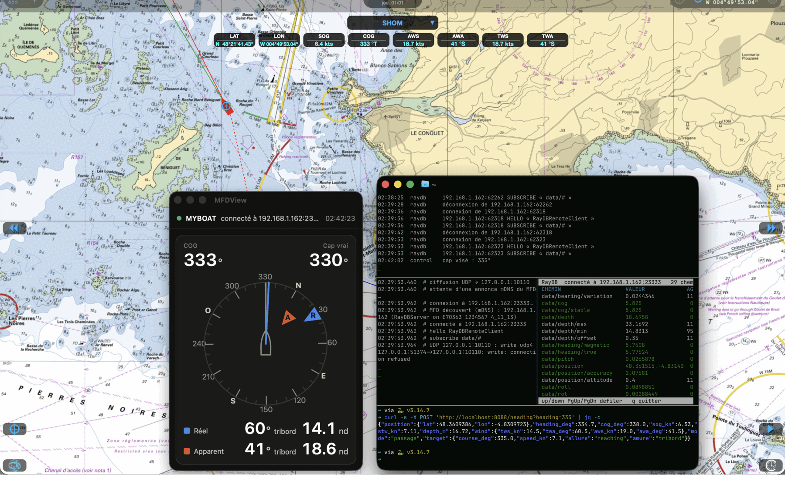
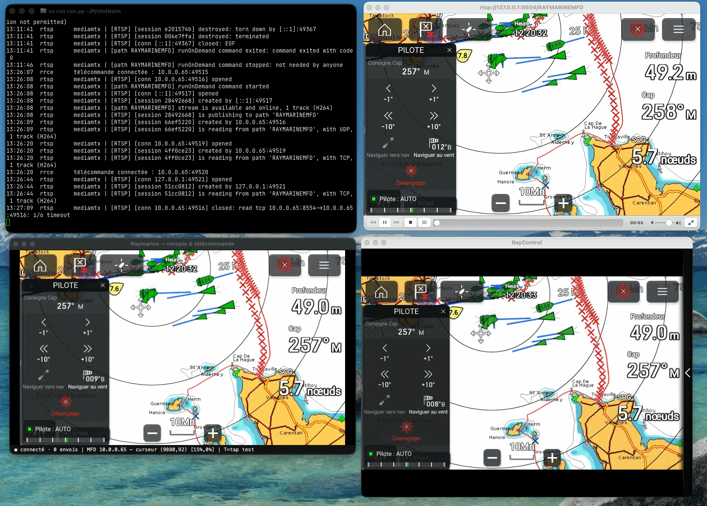

# Raymarine — rétro-ingénierie d'un MFD

Reverse-engineering des protocoles réseau d'un [traceur multifonction (MFD)
Raymarine](https://www.raymarine.com/fr-fr/nos-produits/ecrans-multifonctions/axiom/axiom)
à partir de captures Wi-Fi. Le tout permet de **découvrir**,
**lire la télémétrie**, **piloter à distance** et **accéder en SSH** au MFD.



*MFDView et les clients RayDB / NMEA face au simulateur `mfdsim` — le bateau
simulé croise en mer d'Iroise.*

> Nota: dans tout ce qui suit et les documentations et codes source, « RayConnect » désigne l'app
> [Raymarine](https://www.raymarine.com/fr-fr/nos-produits/applications-et-integrations/raymarine),
> qui a connu plusieurs noms au fil du temps.

## Protocoles étudiés

| Protocole | Transport | Rôle |
|---|---|---|
| ray5800 | UDP multicast `224.0.0.1:5800` | annonce des équipements + leurs canaux de service (`IP:PORT`) |
| mDNS / Bonjour | UDP multicast `224.0.0.251:5353` | annonce des services `_raydb` / `_rym_rrc` / `_rtsp` |
| RayDB | TCP `23333` | bus publish/subscribe clé→valeur (position, cap, vent, profondeur…) |
| RRCE | TCP `50000` | canal d'entrée de la télécommande (touchers, boutons, molette) |
| RTSP | TCP `8554` | recopie vidéo de l'écran (`rtsp://IP:8554/RAYMARINEMFD`) |
| Enrôlement SSH | TCP `8182` | RayConnect y fait autoriser sa clé publique (appairage) |
| SSH/SFTP | TCP `22` | accès `media_rw` par clé RSA |

## Outils

### Clients / passerelles

- `mfd_discover.py` — découverte mDNS des services du MFD (voir « Découverte mDNS »).
- `raydb_client.py` — client RayDB (découverte auto → TCP 23333), une source et
  quatre rendus : TUI curses par défaut, `--dump` en texte au fil de l'eau,
  `--json` en un document par ligne (updates *et* événements de session :
  découverte, HELLO, abonnements), `--nmea` en phrases NMEA 0183 sur stdout
  (`--udp` les diffuse en broadcast, `--udp-to HÔTE[:PORT]` vers une
  destination précise ; l'un comme l'autre impliquent `--nmea`, et la
  diffusion remplace stdout — pour la contrôler, `socat -u
  UDP4-RECV:10110,reuseaddr -`). `--log FICHIER` enregistre le JSON quel que
  soit l'affichage — en `--nmea`, chaque update porte en plus ses phrases.
  `--path` est répétable ; `--replay` rejoue une capture, `--realtime` à sa
  cadence d'origine.
- `raynmea/` — la même passerelle en Go (`go build`, une seule dépendance :
  `hashicorp/mdns`) : découverte mDNS permanente (le MFD peut apparaître plus tard
  ou changer d'IP, la connexion suit), reconnexion RayDB, et **diffusion UDP par
  défaut** vers `127.0.0.1:10110`
  (`-udp-to HÔTE[:PORT]` ailleurs ou en broadcast, répétable ; `-no-udp` pour s'en
  passer). S'y ajoutent au choix les phrases sur stdout ou en fichier (`-nmea`), le
  journal des UPDATE (`-log`) et une TUI SOG/COG/GPS/fond/TWS/TWA (`-tui`). Voir
  `raynmea/README.md`.
- `mfd_remote.py` — recopie d'écran RTSP + télécommande tactile (VLC + RRCE).
- `rm_ssh.py` — connexion SSH/SFTP au MFD via la clé du `user_settings_*.json`.

### Télécommande (RRCE)

- `rrce_touch.py` — injecte touchers, boutons et molette (tap, glissé,
  `key home|menu|back|ok|wpt|switch|zoom±|flèches`, `wheel ±n`, rejeu).
- `rrce_sniff.py` — capture et décode en direct les trames tactiles, boutons et
  molette ; les types de record inconnus sont affichés en hexa.

### Décodeurs hors-ligne

- `udp5800_decode.py` — décode le multicast 5800 depuis un `.pcap`/`.pcapng`.
- `raydb_decode.py` — décode le flux RayDB (pipe tshark).
- `video_extract.py` — reconstitue le flux vidéo H.264 (recopie d'écran RTSP/RTP)
  depuis un `.pcap` : lit les SPS/PPS du SDP, dépaquétise le RTP, écrit un `.h264`
  (option `--mp4`). Ou, avec `--mfd`, enregistre le flux RTSP en direct depuis le
  MFD (découverte auto, ffmpeg `-c copy`). Voir « Reconstruction de la vidéo ».

### Dissecteurs Wireshark (Lua)

- `dissectors/raymarine_5800.lua` (filtre `ray5800`) · `dissectors/raymarine_raydb.lua` · `dissectors/raymarine_rrce.lua` · `dissectors/raymarine_8182.lua`

## Découverte mDNS

Le MFD publie ses services en mDNS/Bonjour, avec des enregistrements TXT qui
donnent modèle, numéro de série et versions — sans passer par le protocole de
découverte UDP 5800 :

| Service | Port annoncé | TXT notables |
|---|---|---|
| `_raydb._tcp` | `49111` | `id`, `name`, `rank`, `group=MFD` |
| `_rym_rrc._tcp` | `50000` | `raymarine-mfd-rrc-version` |
| `_rtsp._tcp` | `8554` | `raymarine-mfd-model`, `raymarine-mfd-serial`, `raymarine-mfd-rtsp-path` |

`mfd_discover.py` parcourt les trois types et affiche adresse, port et TXT. Il
porte ses dépendances (PEP 723), donc rien à installer :

```sh
./mfd_discover.py                  # 5 s d'écoute, sortie lisible
./mfd_discover.py --timeout 15     # réseau lent / MFD en cours de démarrage
./mfd_discover.py --all            # tous les types annoncés sur le réseau
./mfd_discover.py --json           # sortie JSON (scriptable)
```

Équivalent Bonjour en ligne de commande, natif macOS et sans dépendance :

```sh
dns-sd -B _raydb._tcp                       # lister les instances RayDB
dns-sd -B _rym_rrc._tcp                     # télécommande tactile
dns-sd -B _rtsp._tcp                        # flux vidéo
dns-sd -L "RayDBServer on E70363 1234567 4_11_13" _raydb._tcp   # hôte, port et TXT
dns-sd -G v4 E70363-1234567.local           # résoudre le nom en adresse IPv4
```

`dns-sd -B` reste actif jusqu'à `Ctrl-C` — c'est normal, il suit les
apparitions/disparitions en continu.

> Le port annoncé pour `_raydb._tcp` est `49111`, alors que les outils du dépôt
> parlent à `23333` (seul port porteur de trafic dans les captures). À vérifier
> sur un MFD réel.

## Reconstruction de la vidéo

Le MFD diffuse la recopie de son écran en **RTSP (TCP 8554) + RTP/H.264**. À
partir d'une capture de cette session, `video_extract.py` reconstitue un fichier
vidéo lisible — sans rien coder en dur : il lit les paramètres H.264 (SPS/PPS)
dans le **SDP** de la réponse DESCRIBE, énumère les flux RTP, réordonne les
paquets (rebouclage de séquence, déduplication) et **dépaquétise** le H.264
(RFC 6184 : NAL simple, STAP-A, FU-A) en un train Annex-B.

```sh
./video_extract.py pcap/axiom.pcapng --list   # lister les flux RTP
./video_extract.py pcap/axiom.pcapng          # → axiom.h264
./video_extract.py pcap/axiom.pcapng --mp4    # + remux MP4 (ffmpeg)
```

La capture doit contenir le **RTSP** (c'est lui qui apprend à tshark quels ports
UDP disséquer en RTP). Les pertes de paquets UDP laissent quelques macroblocs
corrompus — c'est attendu. Prérequis : `tshark` (et `ffmpeg` pour `--mp4`).

Le simulateur `mfdsim/` rejoue justement une de ces reconstructions
(`mfdsim/video/mfd_screen.h264`, l'écran réel d'un Axiom 7) comme flux RTSP.

### Visionner le flux en direct



*App [RayControl](https://apps.apple.com/fr/app/raycontrol/id523576941) de Raymarine,
recopie d'écran RTSP (VLC) et télécommande tactile (`mfd_remote.py`) contre un MFD
simulé avec `mfdsim`.*

<small>Nota: les dernières versions de l'app Raymarine officielle fonctionnent très mal sur macOS, la recopie est tournée de 90°, et tronquée de surcroît. C'est d'ailleurs une des raisons d'être de ce projet.</small>

Que ce soit un MFD réel ou le simulateur, l'URL est la même
(`rtsp://<ip>:8554/RAYMARINEMFD`). On force le **RTSP sur TCP** (l'UDP perd des
paquets ; c'est aussi requis en mode bridge du conteneur) :

```sh
vlc --rtsp-tcp rtsp://192.168.42.1:8554/RAYMARINEMFD
# macOS (VLC.app) : /Applications/VLC.app/Contents/MacOS/VLC --rtsp-tcp rtsp://…
# ou ffplay :        ffplay -rtsp_transport tcp rtsp://192.168.42.1:8554/RAYMARINEMFD
# ou l'outil dédié :  ./mfd_remote.py 192.168.42.1
```

Options VLC utiles : `--network-caching=300` (latence de démarrage, ms),
`--no-audio` (le flux MFD est vidéo seule).

> **Écran noir au départ ?** Le lecteur attend la première image-clé (IDR) pour
> décoder : jusqu'à ~2 s de noir, c'est normal — laisser tourner.

### Enregistrer le flux en direct (MFD réel)

Sur un MFD sous tension, on capte le flux directement depuis l'URL RTSP, sans
passer par un `.pcap`. Comme `mfd_remote.py`/VLC, on force le **RTSP sur TCP**
(l'UDP perd des paquets) et on **copie** le H.264 sans ré-encoder (sans perte,
CPU quasi nul) :

```sh
ffmpeg -rtsp_transport tcp -i rtsp://192.168.42.1:8554/RAYMARINEMFD -c copy mfd_screen.mkv
```

- **`.mkv`/`.ts`** survivent à un `Ctrl-C` ou à une coupure ; un `.mp4` en
  `-c copy` ne se finalise qu'à un arrêt propre — sinon le rendre fragmenté :
  `-c copy -movflags +frag_keyframe+empty_moov mfd_screen.mp4`.
- **Durée limitée** : ajouter `-t 30` (30 s) ; sans `-t`, enregistre jusqu'au
  `Ctrl-C` (le flux est continu).
- **Vérifier d'abord** que le flux répond :
  `ffprobe -rtsp_transport tcp rtsp://192.168.42.1:8554/RAYMARINEMFD`.
- **URL** : l'IP est celle du Wi-Fi du MFD (via `./mfd_discover.py`, TXT
  `_rtsp._tcp`), pas le `198.18.x.x` interne ; le chemin `RAYMARINEMFD` est
  annoncé dans `raymarine-mfd-rtsp-path`.

La même commande sert à tester le simulateur `mfdsim/`, dont le serveur RTSP
GStreamer expose la même URL.

## Documentation

- `docs/1. protocole-udp5800.md` — spécification de ray5800, le protocole de découverte UDP 5800.
- `docs/2. protocole-raydb-23333.md` — spécification du protocole RayDB (TCP 23333).
- `docs/3. protocole-rrce-50000.md` — spécification du canal d'entrée RRCE : tactile, boutons, molette (TCP 50000).
- `docs/4. ssh-mfd-analyse.md` — accès SSH/SFTP au MFD et fonctionnement de RayConnect.
- `docs/5. protocole-messages-8182.md` — protocole de messages TCP 8182 (service SSHAccess : enrôlement de clé SSH).
- `mfdsim/README.md` — simulateur réseau du MFD (conteneur).
