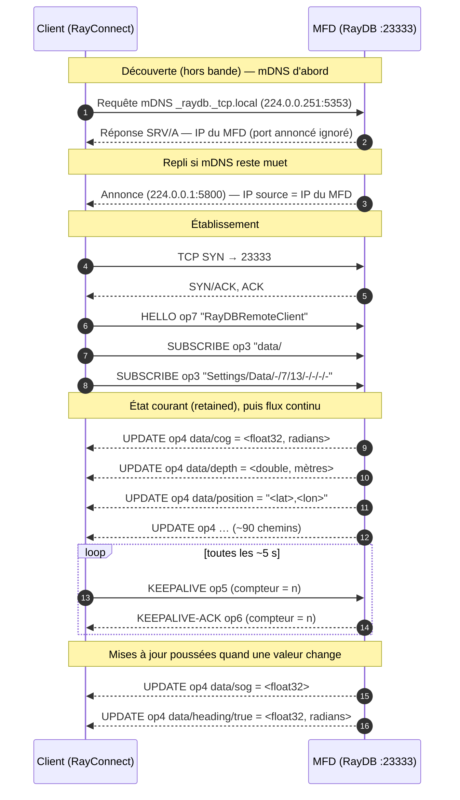

# Protocole RayDB — TCP 23333 (Raymarine)

Outils associés dans ce dépôt :

- `dissectors/raymarine_raydb.lua` — dissecteur Wireshark
- `raydb_decode.py` — décodeur hors-ligne (pipe tshark)
- `raydb_client.py` — client + TUI (découverte mDNS, repli mcast 5800 → connexion 23333)

---

## 1. Vue d'ensemble

**RayDB** est un bus **publish/subscribe clé→valeur** exposé par le MFD Raymarine.
Un client s'y connecte, s'annonce, s'abonne à des arborescences de chemins
(`data/#`, `diag/mfd/#`, …), et le MFD **pousse** les valeurs correspondantes
(position, cap, vent, profondeur, vitesses, tensions, versions firmware, etc.),
d'abord l'état courant (« retained ») puis les mises à jour au fil de l'eau.

| Propriété | Valeur |
| --- | --- |
| Transport | **TCP**, port **23333** |
| Chiffrement | **aucun — trafic en clair**, joignable directement (PAS tunnelé dans SSH) |
| Adresse du service | IP WiFi/LAN du MFD (celle qui émet les annonces de découverte) |
| Endianness | **little-endian** partout |
| Découverte | **mDNS/Bonjour** en premier (`_raydb._tcp.local`, UDP 5353) ; **repli** sur le multicast **224.0.0.1:5800** (voir `dissectors/raymarine_5800.lua`) si mDNS ne répond pas |
| Cadre applicatif | plusieurs trames par segment TCP ; une trame peut être scindée sur plusieurs segments → **réassemblage requis** |

> **mDNS** — l'enregistrement `_raydb._tcp` porte directement l'IP joignable du
> MFD ; seul son adresse est retenue, **le port annoncé (50000) est ignoré** :
> le bus RayDB décrit ici est sur **23333**.

> **5800 (repli)** — l'IP contenue *dans* l'annonce est une adresse interne
> `198.18.x.x` (réseau RayNet), **non joignable** depuis le WiFi. Toujours
> utiliser l'IP **source** du datagramme.

---

## 2. Cycle de vie d'une connexion

1. **Découverte** (optionnelle) : d'abord une requête **mDNS** sur
   `_raydb._tcp.local` — si un service répond, on prend l'IP de son
   enregistrement et on s'arrête là. À défaut (pas de réponse, ou pas de pile
   mDNS disponible), **repli** sur l'écoute des annonces multicast UDP 5800 :
   on retient l'IP source d'une annonce de MFD.
2. **Connexion TCP** vers `IP_MFD:23333`.
3. **HELLO** (op 7) : le client s'annonce (`RayDBRemoteClient`).
4. **SUBSCRIBE** (op 3) : un ou plusieurs abonnements (`data/#`, …).
5. **UPDATE** (op 4) : le MFD envoie l'état courant de tous les chemins couverts,
   puis les changements en continu.
6. **KEEPALIVE** : toutes les **5 s**, le client envoie op 5 (compteur croissant),
   le MFD répond op 6 avec le même compteur.

### Diagramme de séquence



---

## 3. Format d'une trame

Toutes les trames partagent le même en-tête. `len` couvre **tout ce qui suit le
champ `len`** (il ne s'inclut pas lui-même).

```text
 offset  taille  champ        description
 ------  ------  -----------  ------------------------------------------------
   0      u32    len          longueur du reste de la trame
   4      u32    msg_type     toujours 1
   8      u8     op           opcode (voir §4)
   9      u32    path_len     longueur du chemin en octets
  13      u32    pad          réservé / flags (0 observé)
  17      …      path         chemin ASCII (path_len octets, non terminé par \0)
 17+pl    …      value_block  bloc valeur / trailer (voir §5), selon op
```

- **Multi-trames** : un segment TCP peut concaténer plusieurs trames.
- **Réassemblage** : lire `len`, attendre `4 + len` octets avant de décoder.

---

## 4. Opcodes (`op`)

| op | Nom | Sens | Rôle |
| -- | --- | ---- | ---- |
| 3 | **SUBSCRIBE** | C→S | s'abonner à un chemin / sous-arbre (`/#`) |
| 4 | **UPDATE** | S→C | valeur d'un chemin (état initial puis changements) |
| 5 | **KEEPALIVE** | C→S | ping périodique (~5 s), porte un compteur croissant |
| 6 | **KEEPALIVE-ACK** | S→C | pong, ré-écho du compteur reçu |
| 7 | **HELLO** | C→S | annonce du client (`RayDBRemoteClient`) |

> Les opcodes 0 / 100 / 115 aperçus avec un découpage naïf n'existent pas : ce
> sont des artefacts d'un désalignement dû à l'absence de réassemblage TCP.
> Avec réassemblage, seuls 3/4/5/6/7 apparaissent.

---

## 5. Bloc valeur

### 5.1 UPDATE (op 4)

```text
 [3 octets réservés][u32 type][payload…]
```

Les 3 octets réservés valent `00 00 00` sur les UPDATE, et le bloc se termine
par 4 octets nuls. Le `type` détermine le format du payload ; l'énumération se
lit comme une suite d'entiers de largeur croissante, suivie des composites :

| type | format du payload | notes |
| ---- | ----------------- | ----- |
| `0x00` | `bool` (1 octet) | ex. `modeLedCtrl` |
| `0x01` | `i8` (1 octet) | rare, vu en élément de liste |
| `0x02` | `i16` (2 octets) | rare, vu en entrée de table |
| `0x03` | `i32` (4 octets) | entier le plus courant (`Diagnostics/CrashLogCount_*`) |
| `0x04` | `i64` (8 octets) | rare (`Settings/Data/-/10/2/…`) |
| `0x07` | `u32` (4 octets) | entier (ex. adresse CAN) |
| `0x09` | `float32` (4 octets) | grandeurs analogiques (cap, vent…) |
| `0x0a` | `double` (8 octets) | profondeur, min/max… |
| `0x0b` | `[u64 len][octets]` | chaîne (position, IP…) |
| `0x0d` | **liste** (voir ci-dessous) | `availableSysCarto`, `Settings/Data/…` |
| `0x0e` | **table** (voir ci-dessous) | diag/versions/réseau, `sf/…`, alertes |

`0x05`, `0x06`, `0x08` et `0x0c` n'apparaissent dans aucune capture ; la suite
laisse deviner `u8`, `u16` et `u64`, mais rien ne le vérifie.

**Types `0x0d` (liste) et `0x0e` (table)** — deux conteneurs comptés, qui ne
diffèrent que par la présence d'une clé devant chaque élément :

```text
 0x0d  [u64 n]  puis n × ( [u32 type][payload] )
 0x0e  [u64 n]  puis n × ( [u64 klen][clé (klen octets)][u32 type][payload] )
```

Le `payload` suit **immédiatement** son type et se lit selon le même barème que
ci-dessus : il n'y a pas de champ de longueur générique. Seules les chaînes en
portent un, et c'est le `[u64 len]` du type `0x0b` lui-même — d'où l'apparence
trompeuse d'un `vlen` sur les exemples en chaîne.

> ⚠️ Le `0x0e` n'est **pas** une « valeur nommée » : c'est une table de `n`
> entrées, et `n` vaut souvent plus de 1 (jusqu'à plusieurs dizaines). Un décodeur
> qui lit la première entrée et s'arrête perd le reste en silence : une entrée
> `data/exportedCamera/…` porte plusieurs champs (URI RTSP, IP, modèle…), une
> entrée d'`alertHistory/Records/…` de même (horodatage, titre, type…).

> La clé réencodée double **souvent**, mais pas toujours, le dernier segment du
> chemin. D'où le préfixage conditionnel « nom = valeur » de
> `raydb_decode.decode_value`.

> Les longueurs sont des `u64` mais restent petites ; un décodeur peut lire les
> 4 octets bas. (Piège Wireshark 4.6 : `TvbRange:le_uint()` ne gère que ≤ 4
> octets.)

**Unités** — angles en radians, vitesses en m/s, profondeurs en mètres ;
`data/position` est une chaîne `"latitude,longitude"`.

### 5.2 Requêtes HELLO / SUBSCRIBE (op 7 / 3)

Le bloc valeur est un « trailer » de 15 octets :

```text
 [3 octets réservés][u32 type = 0x07][u64 = 0]
```

Les 3 octets réservés sont **opaques** et **diffèrent selon l'opcode** :
`00 01 01` pour HELLO, `01 00 00` pour SUBSCRIBE. Ils sont identiques sur E70363
et E70481 → les reproduire tels quels garantit l'acceptation.

### 5.3 KEEPALIVE (op 5 / 6)

Trame de 32 octets, `path_len = 0`. Bloc valeur
`[00 01 01][u32 0x07][u32 = 0][u32 compteur]` où le compteur s'incrémente à
chaque ping ; le MFD renvoie op 6 avec le même compteur. Cadence observée :
**1 ping / 5 s**.

Le compteur occupe donc les **4 derniers** octets — ceux qui servent de padding
sur les UPDATE, où ils sont toujours nuls.

---

## 7. Espace de noms des chemins

- **`data/…`** — données de navigation live, ex. :
  `data/position`, `data/sog`, `data/cog`, `data/depth[/min|/max|/offset]`,
  `data/heading/{true,magnetic}`, `data/wind/{speed,direction}/{apparent,true}`,
  `data/pitch`, `data/roll`, `data/yaw`, `data/rot`, `data/rudder`,
  `data/bearing/variation`.
- **`diag/mfd/<modèle> <série>/…`** — diagnostics : `network/{ip_address,
  mac_address,sub_net_mask,link_status}`, `cartography_info/*_base_map_version`,
  `nmea2000_info/can_address`, `port*_status/*`, versions firmware.
- **`Settings/Data/…`** — réglages (ex. nom du bateau via
  `Settings/Data/-/7/13/-/-/-/-`).

Un abonnement se termine par `/#` pour couvrir tout un sous-arbre. L'espace de
noms va bien au-delà de la télémétrie de navigation : configuration d'écran et
pilotage de périphériques partagent le même arbre `data/`.

---

## 8. Correspondance RayDB → NMEA 0183

Table implémentée par `raydb_client.py --nmea`. Chaque phrase est déclenchée par **un
seul** chemin, pour éviter les doublons ; les autres chemins ne font
qu'alimenter un cache lu au moment de l'émission. La colonne « YDWG » indique si
une passerelle Yacht Devices branchée sur le même bus émet aussi cette phrase
(relevé dans `pcap/nmea_ydwg.pcap`).

| Phrase | Chemin déclencheur | Chemins en cache | YDWG |
|---|---|---|---|
| `RMC` | `data/position` | `data/sog`, `data/cog`, `data/bearing/variation` | ✅ |
| `GGA` | `data/position` | `data/position/altitude` | ✅ |
| `GLL` | `data/position` | — | ✅ |
| `VTG` | `data/sog` | `data/cog`, `data/bearing/variation` | ✅ |
| `HDT` | `data/heading/true` | — | ✅ |
| `HDM` | `data/heading/magnetic` | — | ✅ |
| `HDG` | `data/heading/magnetic` | `data/bearing/variation` | ✅ |
| `GST` | `data/position/accuracy` | — | ✅ |
| `MWV` (R) | `data/wind/speed/apparent` | `data/wind/direction/apparent` | ✅ |
| `VWR` | `data/wind/speed/apparent` | `data/wind/direction/apparent` | ✅ |
| `MWV` (T) | `data/wind/speed/true` | `data/wind/direction/true` | ✅ |
| `VWT` | `data/wind/speed/true` | `data/wind/direction/true` | ✅ |
| `MWD` | `data/wind/speed/true` | `data/wind/direction/true`, `data/heading/true`, `data/bearing/variation` | ✅ |
| `DPT` | `data/depth` | `data/depth/offset` | ✅ |
| `DBT` | `data/depth` | — | ✅ |
| `DBS` | `data/depth` | `data/depth/offset` | ✅ |
| `VHW` | `data/stw` | `data/heading/true`, `data/heading/magnetic` | ✅ |
| `ROT` | `data/rot` | — | ✅ |
| `RSA` | `data/rudder` | — | ✅ |
| `XDR` | `data/roll` | `data/pitch` | ✅ |
| `VDR` | `data/tide/drift` | `data/tide/set` | ✅ |

**Référentiels** — `data/wind/direction/{true,apparent}` sont des angles
**relatifs à l'étrave**, pas des directions référencées au nord. `MWD`, qui se
réfère au nord, ajoute donc le cap. La formule se recoupe avec une passerelle
YDWG branchée sur le même bus, qui émet `MWD`, `MWV` (T) et `HDT` : `MWD` y vaut
bien `angle MWV_T + HDT`.

**Couverture** — 21 des 29 chemins `data/` sont exploités. Les 8 inutilisés sont
des statistiques ou des grandeurs sans phrase NMEA évidente : `data/cog/stable`,
`data/depth/{min,max}`, `data/sog/{avg,max}`, `data/stw/{avg,max}`, `data/yaw`.

**Écart avec la passerelle YDWG** — les 20 types produits par
`raydb_client.py --nmea` sont tous émis aussi par le YDWG, qui en produit 36 au total.
Les 16 types non couverts demandent des données absentes de `data/#` :

| Manque | Phrases | Source |
| --- | --- | --- |
| Produisibles sans RayDB | `ZDA`, `DTM` | horloge système, datum fixe |
| Données absentes de `data/` | `MTW`, `VLW`, `MDA`, `GSA`, `GSV`, `GRS` | température eau, loch, météo, satellites |
| Navigation / route | `APB`, `BOD`, `BWC`, `RMB`, `RTE`, `WPL`, `XTE`, `HTD` | waypoints et pilote, hors `data/#` |

La navigation demanderait de souscrire à un autre espace de noms que `data/#`
(l'arbre `Settings/…`, non exploré ici).

---

## 9. Notes d'implémentation

- **Réassemblage TCP obligatoire.** Bufferiser, lire `len`, ne décoder que
  lorsque `4 + len` octets sont disponibles ; boucler pour les trames multiples.
- **Piège tshark : `data.data` n'est pas réassemblé.** Avec
  `--only-protocols …,data`, le dissecteur `data` ne demande jamais de
  désegmentation : `data.data` vaut exactement la charge utile d'un segment
  (`len(data.data) == tcp.len`). Il remet les segments dans l'ordre et écarte les
  retransmissions — ce que `tcp.payload` ne fait pas — mais le recollage reste
  à la charge du décodeur, par flux **et par sens**.
- **Captures à trous.** Un segment manquant décale son flux définitivement. Le
  décodeur hors-ligne s'arrête alors sur ce flux plutôt que de deviner un
  recadrage ; Wireshark se resynchronise et rend quelques trames de plus, au
  prix d'une trame aberrante à la reprise.
- **Handshake reproductible.** Envoyer HELLO puis SUBSCRIBE `data/#` avec les
  octets exacts (cf. `build_hello` / `build_subscribe` dans `raydb_client.py`).
- **Keepalive.** Répondre/émettre le ping op5 toutes les 5 s pour éviter que le
  MFD ne considère la session comme morte (à confirmer selon les MFD ; les
  captures montrent le client comme initiateur du ping).
- **Robustesse du décodage.** Traiter les longueurs comme bornées, ignorer les
  blocs valeur trop courts, se rabattre sur un affichage hexadécimal si le
  `type` est inconnu.

---

*Références : `dissectors/raymarine_raydb.lua`, `raydb_decode.py`, `raydb_client.py`,
`1. protocole-udp5800.md` (découverte 5800), `4. ssh-mfd-analyse.md` (auth MFD).*
