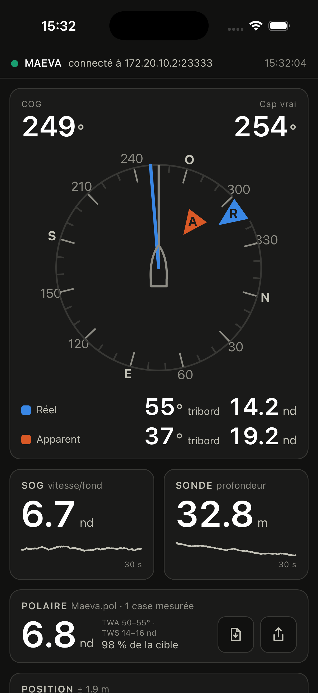

# mfdview — MFDView en application native (Tauri)

Même affichage que `webapp/`, mais **sans passerelle** : le TCP vers le MFD est
fait dans l'application, en Rust. C'est la voie vers une app téléphone autonome,
sans Pi ni Mac à bord.

    ┌─ Rust ──────────────────┐   événements    ┌─ webview ────────────┐
    │ TCP 23333, décodage     │ ─── delta ────▶ │ webapp/static, telle │
    │ RayDB (src/raydb.rs)    │ ─── status ───▶ │ quelle               │
    │                         │                 │                      │
    │ MBTiles (src/mbtiles.rs)│ ◀── tiles: ──── │ Leaflet (map.js)     │
    └─────────────────────────┘   une tuile     └──────────────────────┘

`webapp/static` n'est **pas dupliqué** : `tauri.conf.json` pointe dessus
(`frontendDist`). `app.js` choisit son transport au démarrage — événements
Tauri si `window.__TAURI__` existe, flux SSE de la passerelle sinon. Une seule
interface, deux façons de l'alimenter.

## La carte — macOS, et hors du build par défaut

**`just run` n'a pas de carte.** Elle est derrière la caractéristique Cargo
`map`, que rien n'active d'office :

    just run-map                                      la carte, en développement
    MFDVIEW_MBTILES=/chemin/vers/carte.mbtiles just run-map
    just build-map                                    l'app empaquetée, avec

Le code, lui, reste entier dans le dépôt et `just check` le compile dans les
deux configurations — l'écarter du défaut ne le laisse pas pourrir.

Une fois activée, une **vignette de carte** apparaît sous les coordonnées quand
l'app trouve un jeu de tuiles : carte marine hors ligne, bateau à sa position
RayDB, **nord en haut** toujours (Leaflet ne pivote pas, il n'y a rien à
désactiver). Le sillage se trace en rouge derrière le bateau — au mouillage, il
dessine la rosace de l'évitage, ce qui montre d'un coup d'œil si l'ancre tient.
Pas d'onglet ni de plein écran : c'est une carte de plus dans la page, qui se
fait défiler comme les autres.

Un bouton en bas à droite recentre. Déplacer la carte à la main coupe le suivi ;
seul ce bouton le rétablit.

Sans `MFDVIEW_MBTILES`, l'app prend le premier `*.mbtiles` trouvé dans son
dossier de données (`~/Library/Application Support/com.mfdview.instruments/`), puis
dans `maps/` à la racine du dépôt. **Aucun fichier n'est empaqueté** : le jeu
SHOM du bord pèse trois gigaoctets. Sans carte, la vignette n'apparaît pas et
les instruments fonctionnent comme avant.

Trois barrières se cumulent, dans cet ordre : la caractéristique `map`, puis
`cfg(target_os = "macos")` — ni iOS ni Android n'hébergeraient trois gigaoctets
de tuiles —, puis la présence d'un fichier. Manque l'une des trois et la
commande `map_available` rend `null` : `map.js` s'arrête là, Leaflet n'est même
pas chargé. La page n'a donc jamais à connaître la plateforme. Côté build,
`rusqlite` est `optional` : sans la caractéristique, SQLite n'est pas compilé du
tout, et `just check` continue de vérifier la bibliothèque sur les cibles
iPhone.

## Où on en est

| palier | état |
|---|---|
| **1. macOS, IP en dur** | **fait** — connexion, HELLO/SUBSCRIBE et décodage validés contre `mfdsim` |
| **2. découverte mDNS en Rust** | **fait** — plus aucune adresse en dur |
| **carte MBTiles (macOS)** | **fait**, mais hors du build par défaut (`--features map`) — vignette : tuiles SHOM hors ligne, bateau, sillage rouge, recentrage |
| **3. iOS** | projet Xcode en place, découverte par le Bonjour du système — reste la signature et l'essai sur un vrai iPhone |
| **4. Android** | tourne sur émulateur (page, statut, JNI sans exception) — reste un vrai téléphone, seul à tester la découverte mDNS elle-même |

## Les recettes

`.justfile` rassemble les commandes usuelles ([just](https://just.systems)) :

```sh
just              # la liste, avec une phrase par recette
just run          # l'app sur ce Mac
just mfd          # un MFD simulé, dans un autre terminal
just ios          # compile et lance sur le simulateur iPhone
just iphone       # sur un iPhone relié en USB
just check        # compile-vérifie les trois cibles Apple
just logs / shot  # journaux et capture d'écran du simulateur
just setup        # l'outillage iOS, si la machine est neuve
```

## Lancer

```sh
cd mfdsim && uv run run.py --no-rtsp --no-ssh --no-8182   # un MFD simulé
cd mfdview/src-tauri && cargo run                             # l'application
```

L'app cherche le MFD toute seule (mDNS) et se reconnecte en boucle. Pour forcer
une adresse — banc d'essai, ou MFD qui n'annonce rien :

```sh
MFD_IP=127.0.0.1 cargo run
```

Première compilation ~25 s (Tauri et ses dépendances), ~2 s ensuite. Aucun npm,
aucun bundler : la page est du HTML statique, Tauri l'embarque telle quelle.

## Les fichiers

| fichier | rôle |
|---|---|
| `src/raydb.rs` | le protocole seul : HELLO, SUBSCRIBE, découpage des trames, décodage des UPDATE. Portage de `raydb_decode.py` |
| `src/discovery.rs` | l'aiguillage : le Bonjour du système sur Apple, `mdns-sd` ailleurs |
| `src/discovery/apple.rs` | la recherche par le démon `mDNSResponder` (API DNS-SD) — macOS et iOS |
| `src/discovery/mdns_sd.rs` | la recherche par socket multicast — Linux, Windows, Android |
| `src/discovery/mdns_sd/android.rs` | le `MulticastLock` Android, par JNI directe — sans lui le Wi-Fi filtre le multicast à l'écran éteint |
| `android-postinit-patch.sh` | ajoute au `AndroidManifest.xml` régénéré les autorisations réseau — voir « Android » |
| `android-env.sh` | `JAVA_HOME`/`ANDROID_HOME`/`ANDROID_NDK_HOME`/`PATH`, sourcé par chaque recette Android — `just` n'hérite pas de `~/.bashrc` |
| `src/mbtiles.rs` | la carte : lecture d'un MBTiles (SQLite), bascule TMS, type MIME par signature — macOS, `--features map` |
| `src/lib.rs` | la boucle découverte → connexion, la table chemins → clés, l'envoi vers la page, et le protocole `tiles:` |
| `src/main.rs` | trois lignes : le binaire de bureau appelle `run()` |
| `tauri.conf.json` | fenêtre, identifiant de l'app, chemin de la page |
| `Info.ios.plist` | déclarations iOS fusionnées au build : `NSBonjourServices`, réseau local |
| `icons/icon.png` | l'icône, source unique de toutes les plateformes (`just icons`) |
| `icons/no-alpha.py` | retire le canal alpha des icônes iOS, qu'Apple refuse |
| `capabilities/default.json` | **droits de la page** — voir ci-dessous |
| `Cargo.toml` | `tauri`, `serde_json`, la découverte selon la plateforme (`jni` sur Android), et `rusqlite` sur macOS sous la caractéristique `map` |

## La découverte

`_raydb._tcp` et `_rym_rrc._tcp` portent tous deux l'adresse joignable du MFD ;
on interroge les deux et on garde la première IPv4 résolue. **Le port annoncé
est ignoré volontairement** : le MFD publie 49111 pour `_raydb._tcp` alors que
RayDB écoute sur 23333 — le simulateur reproduit ce piège, et un client qui fait
confiance à l'annonce se connecte dans le vide.

La recherche est refaite à chaque reconnexion, pas seulement au démarrage : le
MFD peut changer d'adresse entre deux (bascule Wi-Fi, redémarrage du bord).

Sur macOS et iOS, elle passe par le **démon Bonjour du système** (`mDNSResponder`,
via l'API DNS-SD de libSystem) : l'application n'ouvre aucune socket multicast,
et échappe donc à l'entitlement `com.apple.developer.networking.multicast`
qu'Apple n'accorde qu'au cas par cas. Ailleurs, `mdns-sd` fait le multicast
lui-même. Même fonction, deux implémentations — d'où le module en trois
fichiers.

Ce qu'on garde de l'annonce est le **nom d'hôte** (`E70363-1234567.local`), pas
l'adresse : `TcpStream::connect` le résout par le même démon, et l'app suit le
MFD s'il change d'IP en cours de route.

## Le moteur de rendu

Tauri n'embarque **aucun** moteur : `wry` délègue à celui du système —
**WKWebView** (WebKit, celui de Safari) sur macOS et iOS, **Android System
WebView** (Chromium) sur Android, WebView2 sur Windows, WebKitGTK sur Linux.
D'où un binaire de quelques Mo, mais un moteur qui change selon la plateforme.

La page est donc à valider sous les deux familles. Elle l'a été : rendu
identique sous Chromium et sous WebKit (aiguilles contre-tournées en SVG,
`display: contents` sur la légende, graphes défilants, `tabular-nums`).

## Trois pièges de Tauri v2

- **La page part sans aucun droit.** Sans `capabilities/default.json` accordant
  `core:default`, même `event.listen` est refusé et la page ne reçoit jamais
  rien — sans erreur visible côté Rust. C'est le premier endroit où regarder si
  l'affichage reste vide alors que le terminal affiche « connecté ».
- **Les événements ne se rejouent pas**, et la webview démarre *après* le thread
  MFD : la page manque le statut et les premières valeurs, dont le nom du bateau,
  poussé une seule fois à l'abonnement. Elle reste alors sur « démarrage… » alors
  que la liaison est faite. D'où l'événement `ready` : la page le lance une fois
  ses écoutes en place (`listen` est asynchrone — l'annoncer plus tôt, c'est
  recevoir la réponse avant d'écouter), et `lib.rs` lui sert le dernier état
  connu. C'est l'équivalent du `snapshot` que la passerelle SSE envoie à chaque
  connexion.
- **`withGlobalTauri: true`** expose l'API JS sur `window.__TAURI__`. C'est ce
  qui permet de garder une page sans build : sans lui, il faudrait importer
  `@tauri-apps/api` avec un bundler.

## iOS

```sh
cargo tauri ios init                # projet Xcode dans gen/apple/, régénérable
cargo tauri ios dev "iPhone 17"     # simulateur
cargo tauri ios dev --host          # iPhone relié en USB
```



Ci-dessus, l'app dans le simulateur iPhone 17, alimentée par `just mfd` : la
rose des vents avec le cap et les deux vents, la vitesse/fond et la sonde avec
leurs trente secondes de trace, la polaire. `just shot` refait cette capture.

Outillage : Xcode, les cibles `aarch64-apple-ios` et `aarch64-apple-ios-sim`,
`cargo-tauri`, et CocoaPods — `brew install cocoapods` de préférence, `ios init`
proposant sinon de l'installer par `gem`, ce qui réclame `sudo`.

Trois choses font l'app mobile, et une seule est du code :

- **le crate est une bibliothèque** — `[lib] crate-type = ["staticlib", …]`. Sur
  iOS il n'y a pas de `main()` : le projet Xcode lie `mfdview_lib` et appelle
  `run()` par `#[tauri::mobile_entry_point]`. `main.rs` ne sert plus qu'au
  bureau.
- **`Info.ios.plist`** — `NSBonjourServices` et `NSLocalNetworkUsageDescription`,
  fusionnés au build dans le `Info.plist` du projet Xcode. Sans eux la
  découverte ne rend jamais rien, **sans la moindre erreur** : iOS filtre
  silencieusement les recherches non déclarées, et une autorisation « Réseau
  local » refusée ressemble à un réseau vide. C'est le premier endroit à
  regarder, avant même le Wi-Fi.
- **la découverte par le démon système** — cf. plus haut. C'est ce qui dispense
  de l'entitlement multicast.

Le reste ne demandait rien : la page était déjà dimensionnée pour un téléphone
(`viewport-fit=cover`, `env(safe-area-inset-*)`), les droits de
`capabilities/default.json` valent sur mobile comme sur le bureau, et le TCP est
le même `std::net`.

### L'icône

`cargo tauri ios init` installe **l'icône de Tauri**, pas la nôtre : le projet
Xcode arrive avec son jeu par défaut, et `bundle.icon` de `tauri.conf.json` ne
le concerne pas. `just icons` refait le jeu depuis `icons/icon.png`, et c'est
maintenant enchaîné derrière `just ios-init` — sinon le logo de Tauri revient à
chaque régénération, `gen/` étant hors dépôt.

Deux détails propres à iOS, tous deux dans la recette :

- **`--ios-color '#111110'`** bouche les coins transparents. iOS pose son propre
  masque arrondi : une icône déjà arrondie ressort rognée deux fois. La couleur
  est celle du fond de la page, le raccord ne se voit pas.
- **le canal alpha est retiré** (`icons/no-alpha.py`). Apple refuse une icône
  qui en porte un, même entièrement opaque — la validation regarde le canal,
  pas les pixels. La CLI en laisse un ; le script redessine les PNG sans, sans
  perte.

### « Failed to request http://127.0.0.1:1430/ »

La version de **développement n'embarque pas la page** : la webview ne lit aucun
fichier, elle relaie chaque requête vers le serveur que `cargo tauri ios dev`
tient sur le port 1430 (le message vient de Tauri, `protocol/tauri.rs`). Deux
causes, donc, pour un même écran :

- **le serveur n'est plus là** — session terminée, app rouverte depuis l'écran
  d'accueil ou par `simctl launch`. `just relaunch` refuse maintenant de partir
  dans ce cas, en disant quoi faire ;
- **sur un vrai iPhone, l'autorisation « Réseau local » a été refusée.** Le
  serveur est sur le Mac, à l'autre bout du Wi-Fi : sans cette permission,
  l'app ne l'atteint pas — Tauri le rappelle d'ailleurs dans la suite du
  message. C'est la même autorisation que celle dont la découverte du MFD a
  besoin : refusée, elle casse les deux. Réglages → Confidentialité et
  sécurité → Réseau local → MFDView.

`just ios-install` construit une version **autonome**, page embarquée, qui ne
dépend d'aucun serveur — c'est ce que sera l'app livrée, et le moyen sûr de
laisser l'app installée entre deux sessions de développement.

### Deux détails qui coûtent des secondes

- **Ne pas connecter sur un nom `.local`.** `TcpStream::connect` sait le
  résoudre, mais `getaddrinfo` demande A *et* AAAA : le MFD n'annonçant pas
  d'IPv6 et le mDNS n'ayant pas de « non », la question AAAA attend 5 s. D'où le
  troisième temps de `discovery/apple.rs`, qui demande l'adresse en IPv4 seule —
  découverte et connexion tiennent alors sous 100 ms.
- **iOS gèle l'app en arrière-plan** : au retour, la socket est morte et le fil
  de discussion dort peut-être encore ses 2 s. `RunEvent::Resumed` le réveille
  (`Wake`, dans `lib.rs`), sans quoi l'écran garde des valeurs figées qui ont
  l'air fraîches — les plus trompeuses en navigation.

### Ce qui reste

**L'essai sur un vrai iPhone.** Le simulateur partage la pile réseau du Mac :
il ne prouve rien sur le Wi-Fi du bord, et le dialogue « Réseau local » n'y
apparaît jamais. Autre écart : `MFD_IP=127.0.0.1` y marche encore, alors que sur
l'appareil `127.0.0.1` désigne le téléphone.

## Mettre l'app sur un iPhone

Toujours une version **autonome** (`cargo tauri ios build`), jamais celle de
`ios dev` : cette dernière ne tient que tant que le Mac sert sa page (voir
l'erreur 1430 plus haut).

### Sur son propre iPhone, compte Apple gratuit

1. **Le premier passage se fait par Xcode**, seul à savoir créer le profil de
   provisionnement et enregistrer l'appareil :

       open src-tauri/gen/apple/mfdview.xcodeproj

   Cible `mfdview_iOS` → *Signing & Capabilities* → cocher *Automatically manage
   signing* → choisir l'équipe (`… (Personal Team)`), l'Apple ID étant ajouté
   dans *Xcode → Settings → Accounts*. Un premier *Run* sur l'iPhone relié
   règle tout d'un coup.

2. **Relever l'identifiant d'équipe**, dix caractères, dans *Settings →
   Accounts* (colonne *Team ID*), ou depuis le profil que Xcode vient d'écrire :

       security cms -D -i ~/Library/MobileDevice/Provisioning\ Profiles/*.mobileprovision \
         | plutil -p - | grep TeamIdentifier -A2

3. **Ensuite, tout se fait en ligne de commande** :

       export TAURI_APPLE_DEVELOPMENT_TEAM=XXXXXXXXXX
       cargo tauri ios build --debug --target aarch64
       xcrun devicectl device install app --device "iPhone de René" <chemin affiché>

   La CLI imprime le chemin du bundle en fin de build (« Finished 1 iOS Bundle
   at: … »), et `xcrun devicectl list devices` donne le nom exact du téléphone.

4. **Sur l'iPhone, la première fois** : Réglages → Général → VPN et gestion de
   l'appareil → faire confiance au développeur. Puis, au lancement, accepter
   « Réseau local » — sans quoi le MFD reste introuvable, en silence.

**La limite du compte gratuit** : l'app **expire au bout de sept jours** (et
trois apps à la fois). Passé ce délai elle refuse de s'ouvrir ; il faut
reconstruire et réinstaller. C'est le prix de zéro euro.

### Sur un iPhone qui n'a pas ce compte

Le compte gratuit ne sait pas le faire : il ne signe que pour les appareils que
*ce* Xcode a enregistrés, et l'app expire en une semaine. Trois voies, de la
moins chère à la plus commode :

- **Le téléphone a son propre Mac.** La personne clone le dépôt, met son Apple
  ID et refait la section précédente chez elle. Gratuit, et les sept jours
  s'appliquent toujours.
- **TestFlight**, avec le programme développeur (99 €/an) — la voie normale
  pour faire essayer l'app :

      cargo tauri ios build --export-method app-store-connect

  téléverser l'IPA (Transporter, ou `xcrun altool --upload-app`), puis inviter
  dans App Store Connect, par courriel ou par lien public. La personne n'a
  besoin que d'un Apple ID à elle et de l'app TestFlight : **aucun UDID à
  collecter**. Chaque build vaut 90 jours. Les testeurs internes (membres de
  l'équipe) reçoivent le build tout de suite ; les externes attendent une revue
  Apple, rapide mais réelle.
- **Ad hoc**, même compte payant, sans TestFlight — pour un ou deux téléphones
  connus. Relever l'UDID de l'appareil (Finder, page de l'appareil, cliquer sur
  la ligne d'informations jusqu'à la voir ; ou Apple Configurator), l'enregistrer
  dans le portail développeur (cent appareils par an, liste vidée seulement au
  renouvellement), puis :

      cargo tauri ios build --export-method release-testing

  L'IPA s'installe par Apple Configurator, ou depuis une page HTTPS portant un
  manifeste `itms-services`. Valable un an.

En clair : **sans compte payant, on ne met pas l'app sur le téléphone d'un
autre**, à moins qu'il n'ait un Mac.

## Android

```sh
just setup-android    # cibles Rust, une fois
just android-init     # projet Gradle dans gen/android, régénérable
just emulator          # un émulateur, dans un autre terminal
just android           # cargo tauri android dev, sur appareil ou émulateur
just android-build     # APK de debug
```

Contrairement à iOS, tout s'installe aussi bien sous Linux : pas besoin d'un
Mac pour ce palier. Il faut un SDK Android (`ANDROID_HOME`), un NDK dedans, un
JDK 17 (`JAVA_HOME`), `cargo-tauri`, et les cibles Rust que pose
`setup-android` (`aarch64-linux-android` en premier — les trois autres ne
servent qu'à un APK universel). Pour l'émulateur, un paquet `system-images`
en plus (`sdkmanager "system-images;android-34;google_apis;x86_64"`) et un AVD
(`avdmanager create avd -n mfdview -k "system-images;android-34;google_apis;x86_64" -d pixel_6`) —
x86_64, pas arm64 : c'est ce qui profite de l'accélération KVM sur un hôte
Intel/AMD (`emulator -accel-check` le confirme), là où un système arm64 sur un
hôte x86_64 tournerait sans accélération, très lentement.

La découverte passe déjà par `mdns-sd` (`src/discovery/mdns_sd.rs`) : c'est le
même chemin que Linux et Windows, aucun code neuf à ce niveau. Ce qui manquait,
propre à Android :

- **Le `MulticastLock`.** La plupart des téléphones filtrent les trames
  multicast (224.0.0.251:5353) dès que l'écran s'éteint, pour économiser la
  radio Wi-Fi — sans ce verrou, `mdns-sd` ouvre bien sa socket mais ne reçoit
  jamais rien. `src/discovery/mdns_sd/android.rs` le prend par JNI directe le
  temps d'une recherche (une poignée RAII : `Drop` le relâche), plutôt que par
  un greffon Tauri — même choix que `discovery/apple.rs` côté Bonjour, l'API
  visée (`android.net.wifi.WifiManager`) n'ayant pas de crate dédiée qui vaille
  une dépendance de plus.
- **`ndk_context` ne marche pas ici.** C'est le moyen habituel de retrouver le
  contexte Android depuis Rust, mais le greffon Android de Tauri 2 (une
  activité Kotlin qui charge cette bibliothèque par `System.loadLibrary`)
  n'appelle jamais `ndk_context::initialize_android_context`, ni `wry` ni
  `tao` non plus. `android.rs` capte donc le `JavaVM` lui-même dans
  `JNI_OnLoad`, que le système appelle une fois au chargement de la
  bibliothèque — avant toute commande Tauri.
- **Les autorisations.** `INTERNET` (le TCP vers le MFD), `ACCESS_WIFI_STATE`
  et `CHANGE_WIFI_MULTICAST_STATE` (le verrou ci-dessus) doivent être dans
  `AndroidManifest.xml` — un fichier que `cargo tauri android init` régénère
  à chaque fois, comme `gen/apple` côté iOS. `android-postinit-patch.sh` les
  y ajoute après coup, idempotent ; `just android-init` l'enchaîne déjà.

### Ce qui reste

**L'essai sur un vrai téléphone**, mais le reste a été vérifié pour de bon,
pas seulement compilé dans le vide : SDK et NDK posés
(`ANDROID_HOME=~/Android/sdk`, NDK 28.2.13676358, JDK 17, cibles Rust), un AVD
`mfdview` (Pixel 6, Android 14, x86_64, accéléré par KVM) créé par
`avdmanager`. Dessus,
l'app installée (`adb install`) **s'est lancée, a affiché la page — rose des
vents, cartes SOG/sonde, polaire, position — et son statut de connexion sans
qu'aucune exception ne remonte au journal**, `JNI_OnLoad` et le
`MulticastLock` compris (aucun message d'échec de `android.rs`, qui ne parle
qu'en cas de problème). Un aléa d'émulateur (Google Play Services tué en
arrière-plan) a fait mourir l'app une fois par ricochet ; relancée, elle a
tourné sans problème.

Ce que l'émulateur **ne** prouve pas : la découverte mDNS elle-même. Son
réseau NAT par défaut ne relaie pas le multicast entre l'invité et le Wi-Fi
du bord — `just mfd` sur l'hôte y resterait invisible, verrou ou pas. Seul un
vrai téléphone, sur le vrai Wi-Fi du bord, teste ce chemin-là pour de bon.

## Ce qui reste ailleurs

**macOS empaqueté** (`cargo tauri build`) : l'app durcie a besoin de
`com.apple.security.network.client`. En `cargo run`, le binaire de debug n'est
pas sandboxé, la question ne se pose pas encore.
